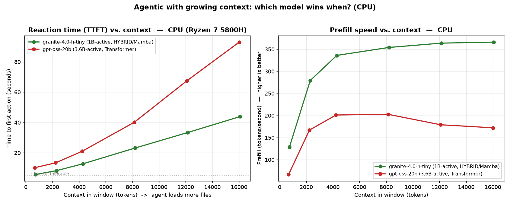
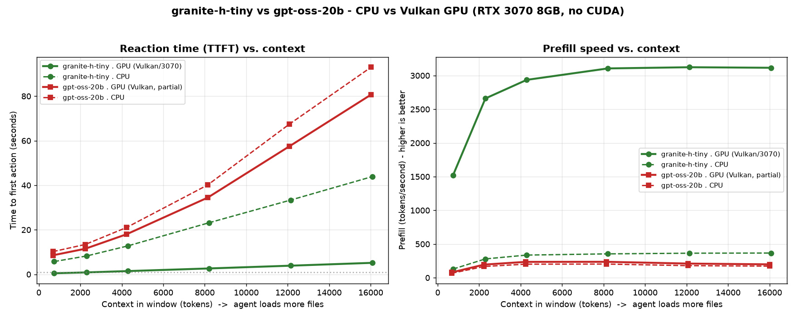

<!--
SPDX-FileCopyrightText: 2026 Bernard Ladenthin <bernard.ladenthin@gmail.com>
SPDX-License-Identifier: Apache-2.0
-->

# Agentic reaction‑time benchmark (local models, CPU)

Measures **reaction time** (time‑to‑first‑token / prefill), decode speed, and **native
tool‑calling capability** for an agentic use case (e.g. Continue.dev), via `llama-server`
with `--jinja` (OpenAI‑compatible `/v1/chat/completions` + `tools`). One tool is defined
(`run_tests(module)`) and the model must emit a valid `tool_call`.

- **Hardware:** AMD Ryzen 7 5800H (8 threads), CPU‑only unless noted. RTX 3070 8 GB for the GPU note.
- **Harness:** `tools/agentic-cpu-ctx.sh` (context sweep) and `tools/agentic-bench.sh` (single‑shot),
  parsers `tools/parse-agentic*.py`, plot `tools/plot-context-curves.py`. Raw data in `tools/*.tsv`.

## 1. Which models can actually do agentic (native tool_calls)?

| Model | tool_call | note |
|---|---|---|
| **granite‑4.0‑h‑tiny** (1B‑act hybrid) | ✅ native | + fastest |
| **gpt‑oss‑20b** (3.6B‑act) | ✅ native | quality, but slow (reasoning) |
| Qwen2.5‑Coder‑14B / 32B | ⚠️ **text only** | emits `<tool_call>` as prose; llama‑server didn't parse it natively here |
| DeepSeek‑Coder‑7B‑v1.5 (Q8) | ❌ **none** | 2024 coder, no tool training |

Only **h‑tiny** and **gpt‑oss** produced valid native tool calls out of the box.

## 2. Reaction time vs. context (the agent loads files → context grows)

CPU reaction time (TTFT) and prefill speed vs. context size for the two agentic‑capable models:

| context (tokens) | h‑tiny TTFT | gpt‑oss TTFT | h‑tiny faster by |
|---|---|---|---|
| ~700 | 5.7 s | 10.2 s | 1.8× |
| ~2,200 | 8.2 s | 13.4 s | 1.6× |
| ~4,200 | 12.8 s | 21.0 s | 1.6× |
| ~8,200 | 23.2 s | 40.1 s | 1.7× |
| ~12,000 | 33.4 s | 67.4 s | 2.0× |
| ~16,000 | 43.9 s | 93.0 s | **2.1×** |

**No speed crossover: h‑tiny wins at every context, and the lead *grows* as context fills.**
Prefill speed explains it — h‑tiny (hybrid/Mamba) *rises* with context and plateaus high
(129 → 366 tok/s); gpt‑oss (transformer) peaks (~203) then *degrades* (172 at 16k) as O(L²)
attention bites.

## 3. Full 5‑model CPU table (reaction time by context)

From `tools/agentic-5models-cpu.tsv` (TTFT / decode tok/s / tool_ok):

| Model | ~700 tok | ~3.3k tok | ~16k tok | decode |
|---|---|---|---|---|
| granite‑4.0‑h‑tiny | 6.0 s / ✅ | 19.3 s / ✅ | 46 s / ✅ | ~9 |
| gpt‑oss‑20b | 30 s* / ✅ | 18.8 s / ✅ | 101 s / ✅ | 3–7 |
| deepseek‑coder‑7b‑v1.5 | 18.9 s / ❌ | 69.6 s / ❌ | — | 3–5 |
| Qwen2.5‑Coder‑14B | 32 s / ⚠️ | 108 s / ⚠️ | ctx‑err | 2.5–3 |
| Qwen2.5‑Coder‑32B | 45 s / ⚠️ | 113 s / ⚠️ | ctx‑err | 1.6–1.9 |

\* cold first request; warm prefill ~160 tok/s.

## 3b. GPU backend: OpenCL vs Vulkan (non‑CUDA), and CPU‑vs‑GPU curves

Goal: a **non‑CUDA** GPU path on the RTX 3070 (8 GB).

- **OpenCL does NOT work on this NVIDIA GPU.** llama.cpp's OpenCL backend finds the card but rejects
  it: `ggml_opencl: unsupported GPU 'NVIDIA GeForce RTX 3070 Laptop GPU'. drop unsupported device` →
  `no usable GPU found, --gpu-layers ignored` (falls back to CPU). llama.cpp OpenCL targets
  Adreno/Qualcomm; desktop NVIDIA/AMD are out.
- **Vulkan works and is ~CUDA‑fast** (vendor‑neutral). The winget `llama-server` is a Vulkan build and
  sees the 3070 as `Vulkan1`. Use `--device Vulkan1 -ngl <N>`.

CPU vs Vulkan‑GPU, reaction time + prefill vs context, both models:

| combination | TTFT @16k | prefill |
|---|---|---|
| **granite‑h‑tiny · GPU (Vulkan, full)** | **5.2 s** | ~3100 tok/s |
| granite‑h‑tiny · CPU | 43.9 s | ~366 tok/s |
| gpt‑oss‑20b · GPU (Vulkan, 6/24 layers) | 80.7 s | ~200 tok/s |
| gpt‑oss‑20b · CPU | 93.0 s | ~172 tok/s |

**h‑tiny fully fits the 8 GB GPU → the only interactive combo** (TTFT stays < 5.2 s even at 16k).
**gpt‑oss (11 GB) does not fit → only 6/24 layers offload → barely faster than CPU** (still 8–81 s);
it stays CPU‑bound. So on this hardware the winning setup is unambiguous: **run the small hybrid on
the GPU (Vulkan); big models are async/CPU only.**

## 4. Takeaways for interactive/agentic use on this laptop

- **The only responsive agentic model on CPU is `granite‑h‑tiny`** — smallest, hybrid, native
  tool‑calling, fastest, and its lead grows with context.
- **`granite‑h‑tiny` fits the 8 GB GPU (3.96 GB)** → measured **165 ms** TTFT + 146 tok/s there
  (vs 5.7 s on CPU). So run it on the GPU: the CPU curves above are the worst case.
- **gpt‑oss** = quality/async only (30–100 s reaction).
- **14B/32B dense coders are async‑only on CPU** (45–113 s even at low context) — "hand it off,
  get coffee". `RAM fitting ≠ interactive speed` — the CPU memory‑bandwidth bottleneck dominates.
- Big‑model "20–30 tok/s on CPU" claims do **not** hold here: measured decode is ~2–3 tok/s (14B/32B).

> Temporary experiment scaffold, not production config.
